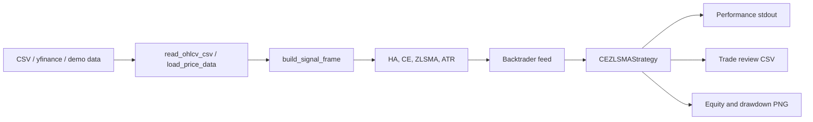

# Architecture / 架构说明

## Goal / 目标

The project wraps a single-file strategy into a maintainable, testable, and publication-ready open-source package while preserving strategy behavior.

本项目把单文件策略包装成可维护、可测试、可发布的开源工程，同时尽量保持策略行为稳定。

## Layout / 目录结构

```text
ce-zlsma-xauusd/
  .github/
    workflows/ci.yml
    ISSUE_TEMPLATE/
    pull_request_template.md
  data/
  docs/
  pine/
  reports/baseline/
  scripts/
  src/ce_zlsma_xauusd/
    config.py
    runner.py
    engine.py
  tests/
  README.md
  USAGE.md
  TEST_REPORT.md
  pyproject.toml
```

## Layers / 分层

| Layer / 层 | Responsibility / 职责 |
| --- | --- |
| Interface / 接口层 | `cli.py`, `__main__.py`, scripts. Provides command-line and reproducible shell entry points. |
| Application / 应用层 | `runner.py`. Converts immutable job configuration into a backtest run. |
| Configuration / 配置层 | `config.py`. Holds typed dataclasses for data, risk, strategy, and output settings. |
| Domain engine / 领域引擎 | `engine.py`. Contains data loading, indicator construction, Backtrader strategy, execution assumptions, and reporting. |
| Verification / 验证层 | `tests/`, `reports/baseline/`, CI workflow. |

## Data Flow / 数据流



## Design Choices / 设计取舍

- Keep the migrated strategy in `engine.py` to reduce behavioral migration risk.
- Add `config.py` and `runner.py` as a stable application boundary for notebooks, services, and future orchestration.
- Use a `src` layout to prevent accidental imports from the repository root.
- Use `pyproject.toml` for package metadata, dependencies, and console script registration.
- Use `unittest` to avoid extra test dependencies.
- Keep the baseline command, dataset checksum, generated artifacts, and report in the repository for reproducible review.

- 保留 `engine.py` 中的迁移策略主体，降低重构导致交易行为变化的风险。
- 增加 `config.py` 和 `runner.py`，为 Notebook、服务化调用和未来调度层提供稳定边界。
- 使用 `src` 布局，避免从仓库根目录误导入。
- 使用 `pyproject.toml` 管理包元数据、依赖和命令行入口。
- 使用 `unittest`，减少额外测试依赖。
- 在仓库内保留基线命令、数据校验、生成物和报告，便于复审复现。

## Extension Roadmap / 后续扩展

Recommended next steps:

建议后续演进：

- Split `engine.py` into `data.py`, `indicators.py`, `strategy.py`, `execution.py`, and `reporting.py` after the current baseline is locked.
- Add TOML or YAML config loading on top of the typed dataclasses.
- Add out-of-sample, walk-forward, and parameter sensitivity reports.
- Add data-quality validation before every backtest.
- Add broker adapters only after a dedicated live-trading risk layer is designed and tested.
